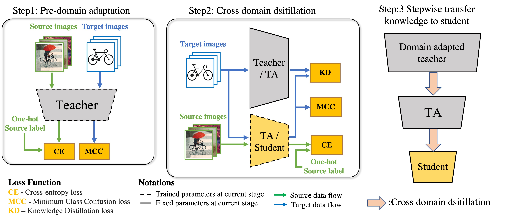
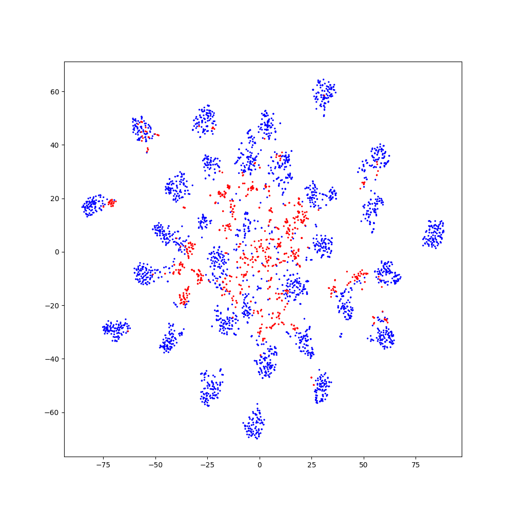
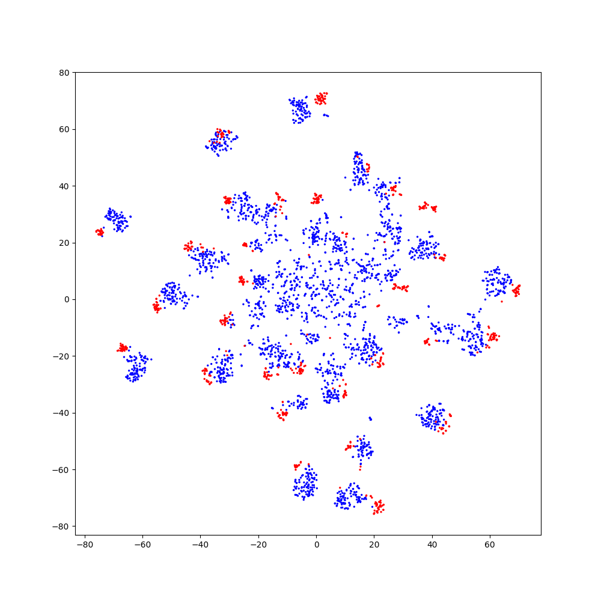
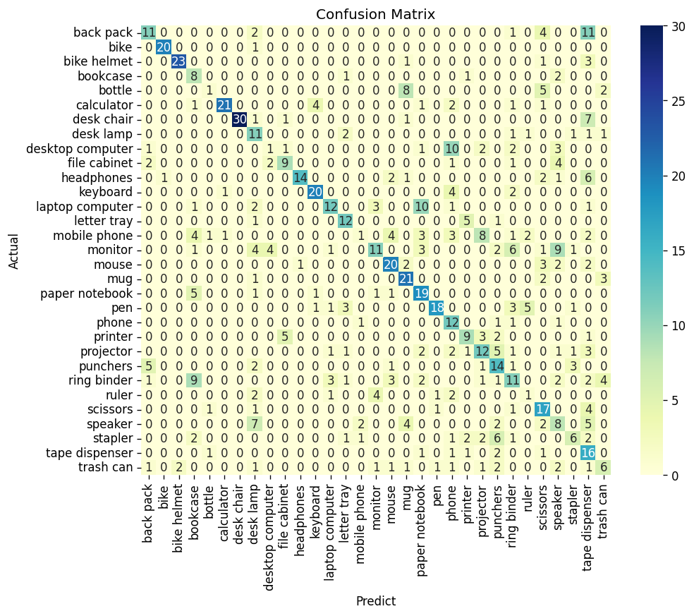
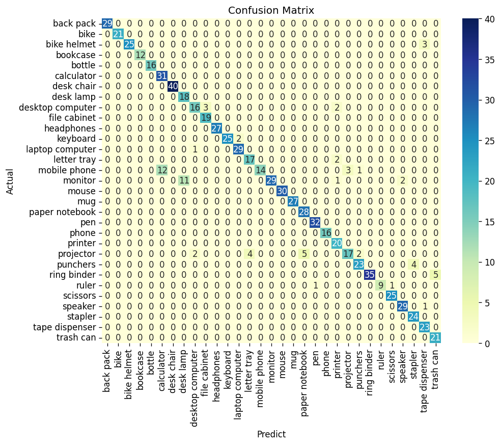

# Stepwise Cross Domain Distillation (SCDD)

<div align="center">
    
</div>

----------------------------------------------------------------------------------------------------

# Contents
1. [Introduction](#Introduction)
2. [Functionality](#Functionality)
3. [Experiment](#Experiment)
4. [Citation](#Citation)
5. [License](#License)
6. [Reference](#Reference)

## Introduction

SCDD is UDA method for lightweight model. Lightweight model can be trained by cross domain distillation.
This research was published at [APRIS2021](http://sigemb.jp/APRIS/2021/) and paper can be downloaded at [IPSJ](https://ipsj.ixsq.nii.ac.jp/ej/?action=pages_view_main&active_action=repository_view_main_item_detail&item_id=216177&item_no=1&page_id=13&block_id=8).

## Functionality
## Experiment
- Clone this repository and make the current directory `/source`.
```
$ git clone https://github.com/TaiseiYamana/SCDD.git
$ cd SCDD/source
```
### Training
- Running the shell script file in `/source/scripts/` will start the learning process. You can simply specify the hyper-parameters listed in `/source/xxx.py` or manually change them.

- Conducting Source only (normal training)
```
$ bash scripts/of31/source_only.sh
```
Mdoel : `AlexNet`, Dataset : `Office-31`
- Conducting Cross Domain Distillation (cdd)
```
$ bash scripts/of31/cdd_by_mcc_from_mcc.sh
```
Student model : `AlexNet`, Teacher model : `ResNet50`,\
Dataset : `Office-31`

### Analysis
- Running the '/source/analysis.py' can  visualize the cross-domain feature representation of the trained model using T-SNE. At the same time, confusion matrix for the target domain is created.

- A sample of the code can be run in analysis.sh.
```
$ bash scripts/of31/analysis.sh
```
Mdoel : `AlexNet`, Dataset : `Office-31` \
Comparison method : `source_only`, `cdd_by_mcc_from_mcc`
- Display of T-SNE

(Left : source_only, Right : cdd_by_mcc_from_mcc)
<div>
    <tr>
    <td></td>
    <td>
    </td>
    </tr>
</div>

<p style="text-indent:1em;"></p>

- Display of Confusion Matrix

(Left : source_only, Right : cdd_by_mcc_from_mcc)
<div>
    <tr>
    <td></td>
    <td>
    </td>
    </tr>
</div>

## Requirements
- python 3.7
- pytorch 1.10.0
- torchvision  0.11.1

## Citation
Please cite these papers in your publications if it helps your research.
```
@inproceedings{weko_216177_1,
   author	 = "Taisei,Yamana and Yuko,Hara-Azumi",
   title	 = "Edge Domain Adaptation through Stepwise Cross-Domain Distillation",
   booktitle	 = "Proceedings of Asia Pacific Conference on Robot IoT System Development and Platform",
   year 	 = "2022",
   volume	 = "2021",
   number	 = "",
   pages	 = "1--7",
   month	 = "jan"
}
```
Links to the papers:
- Edge Domain Adaptation through Stepwise Cross-Domain Distillation(https://ipsj.ixsq.nii.ac.jp/ej/?action=pages_view_main&active_action=repository_view_main_item_detail&item_id=216177&item_no=1&page_id=13&block_id=8)
## License
## Reference
[TLlib](https://github.com/thuml/Transfer-Learning-Library)
