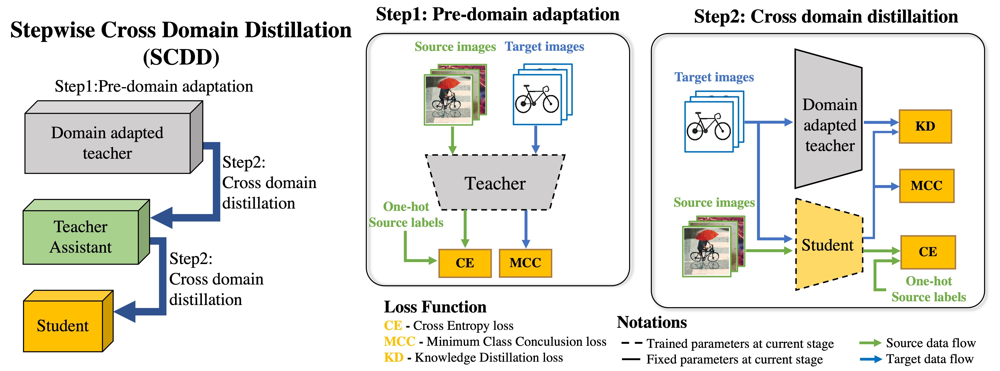

# Stepwise Cross Domain Distillation (SCDD)

<div align="center">
    
</div>


----------------------------------------------------------------------------------------------------


# Contents
1. [Introduction](#Introduction)
2. [Functionality](#Functionality)
3. [Experiment](#Experiment)
4. [Citation](#Citation)
5. [License](#License)
6. [Reference](#Reference)

## Introduction

SCDD is UDA method for lieghtweight model. Lightweight model can be trained by cross domain distillation. This research was published at [APRIS2021](http://sigemb.jp/APRIS/2021/) and paper can be downloaded at [IPSJ](https://ipsj.ixsq.nii.ac.jp/ej/?action=pages_view_main&active_action=repository_view_main_item_detail&item_id=216177&item_no=1&page_id=13&block_id=8).

## Functionality
## Experiment
## Citation
```
@inproceedings{weko_216177_1,
   author	 = "Taisei,Yamana and Yuko,Hara-Azumi",
   title	 = "Edge Domain Adaptation through Stepwise Cross-Domain Distillation",
   booktitle	 = "Proceedings of Asia Pacific Conference on Robot IoT System Development and Platform",
   year 	 = "2022",
   volume	 = "2021",
   number	 = "",
   pages	 = "1--7",
   month	 = "jan"
}
```
## License
## Reference
